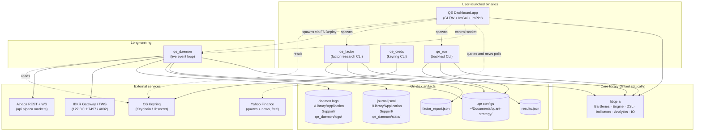
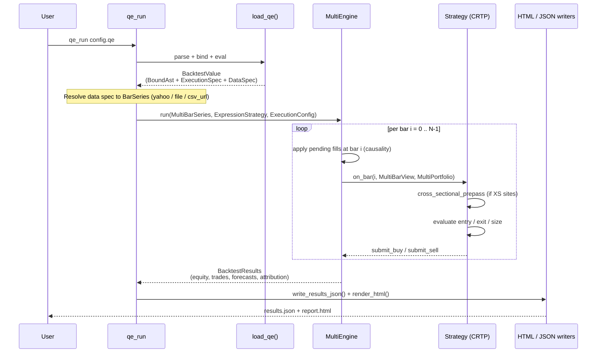
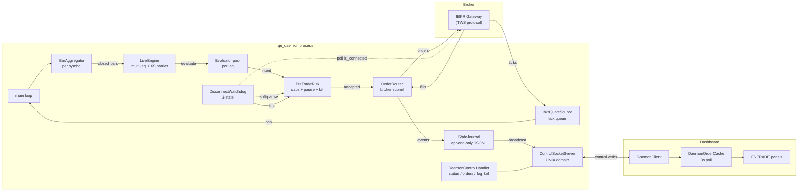
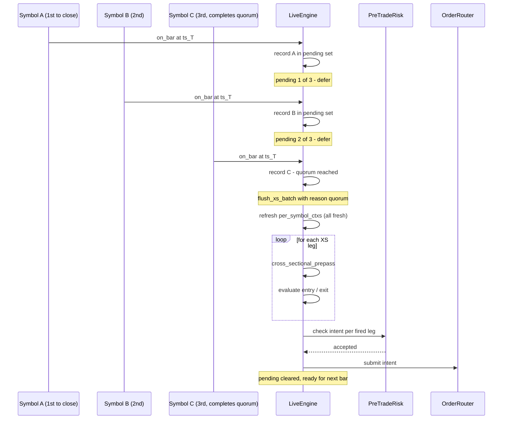
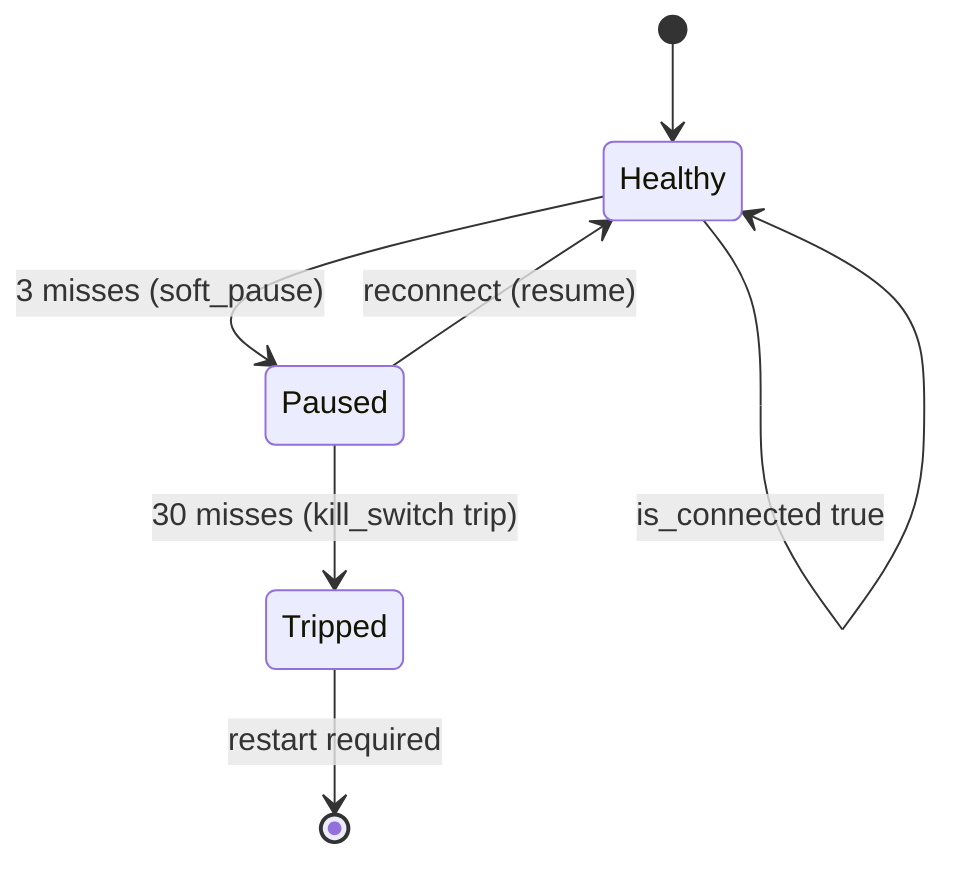
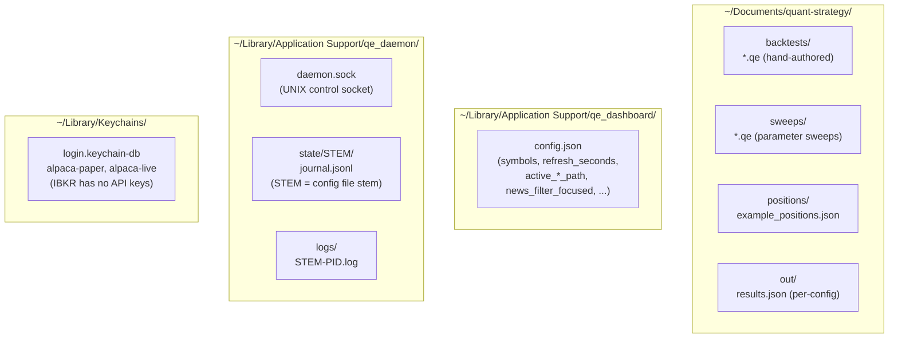

# Architecture

This page is the "how does it all fit together" entry point —
the binaries that ship, how they talk to each other, and the
shape of the data that flows through them.

## What ships

**Five binaries, one core library.** Every binary links libqe.a
statically — the same backtest engine that powers `qe_run` also
powers `qe_daemon`'s live event loop. The dashboard's
backtest-results renderer and the factor-research viewer read
the same files the CLIs produce. **No client/server inside the
process tree** — the dashboard and the daemon communicate over
a UNIX domain control socket; everything else is a one-shot
subprocess fork (Cmd+S on F3 → `qe_run`).

## Backtest data flow (`qe_run` and the F3 → Cmd+S path)

**Key invariants** (the engine enforces these structurally; no
strategy can bypass them):

- **Causality.** Signals computed at bar `i` may use data from
  bars `0..i`. Fills execute at bar `i+1`'s open, never `i`'s
  close. See `MultiEngine`'s hot loop — `apply_fill` runs BEFORE
  `strategy.on_bar` each tick.
- **Single signal evaluator pool per strategy.** Stateful
  indicators (`sma`, `ema`, `rsi`, `atr`, `rolling_*`, ...) keep
  one in-memory pool per Evaluator. The same Evaluator powers
  backtest AND live — see "Live trading data flow" below.
- **Zero allocations in the hot loop.** Every `std::vector`
  holding trades / equity points is `reserve()`-d to a known
  upper bound. Verified by `tests/test_alloc_counter.cpp`.

## Live trading data flow (`qe_daemon` + dashboard attach)

**The dashboard is a polite observer.** It does not own the
broker session — `qe_daemon` does — so closing the dashboard
window leaves trading running unchanged. The dashboard attaches
over the control socket (`~/Library/Application Support/qe_daemon/daemon.sock`),
polls daemon-side state every 3 s, and renders it through the
F6 panels (Working Orders / Executions / Account / Order Log).
Control verbs (`stop`, `kill`, `pause`, `resume`) flow back the
same way.

**Why the daemon is its own process** — broker connections
authenticate per client; one client per account. Putting the
broker session inside the dashboard means closing the dashboard
disconnects the broker → kills the strategy → cancels open
orders. Putting it in a long-running daemon is the only safe
design for headless / overnight strategies.

## Cross-sectional fork-join barrier (EPIC-69)

The live engine's tricky bit. Cross-sectional strategies
(`signalize_universe`, anything with `is_top` / `is_bottom` /
`quantile`) need ALL universe symbols' bars to be fresh before
computing ranks. Without a barrier, the first symbol to close
at session-end would trigger the prepass against 1 fresh +
(N-1) stale slots — the strategy's first rebalance would be
effectively random.

**Three flush reasons** appear in the daemon log as
`[xs_batch:reason]` suffixes:

| `reason` | When | Operator action |
|---|---|---|
| `quorum` | Every universe symbol ticked at ts. The healthy case. | None |
| `new_ts` | A bar at a fresh ts arrived while a prior batch was still pending. Prior batch force-flushed with stale slots. | Investigate why a symbol skipped a bar. |
| `timeout` | 5 s wall-clock since batch start without quorum. WARN log. | Same as `new_ts`. |

Non-cross-sectional portfolios bypass the barrier entirely
(per-bar fast path).

## Disconnect watchdog state machine (EPIC-70)

**Transition callbacks** (omitted from the diagram for parser
simplicity):

| Transition | Callback fired |
|---|---|
| `Healthy → Paused` | `on_soft_pause("ibkr_disconnect_soft")` → `PreTradeRisk::set_watchdog_pause` |
| `Paused → Healthy` | `on_resume()` → `PreTradeRisk::clear_watchdog_pause` |
| `Paused → Tripped` | `KillSwitch::trip("ibkr_disconnect")` + cancel every open broker order |

- **Healthy** → normal operation.
- **Paused** → new orders reject (`PreTradeRisk` gate). Open
  orders untouched. Auto-resumes on reconnect within the trip
  window. Reversible.
- **Tripped** → KillSwitch tripped, open orders cancelled,
  daemon needs restart. Sticky.

The dashboard's F6 `broker:` badge reflects the state directly:
`connected` (green) / `paused · Ns` (amber, with miss count) /
`TRIPPED (reason)` (red).

## On-disk layout

**One folder per concern.** The workspace lives under
`~/Documents/quant-strategy/` (overridable via `Cmd+,` →
Settings → Workspace). The dashboard's own state goes under
`Application Support/qe_dashboard/`. The daemon's runtime state
(socket, journal, logs) lives under
`Application Support/qe_daemon/` — distinct from the dashboard
so multiple daemons (one per `.qe`) can share the same machine.

## Where to go next

- **Build + setup** — [`install.md`](install.md): wizard,
  scripted install, broker credentials.
- **Author a strategy** — [`first-factor-tutorial.md`](first-factor-tutorial.md):
  10-minute walkthrough from clone to a saved `.qe`.
- **Read the `.qe` reference** — [`qe-language.md`](qe-language.md):
  grammar + every builtin.
- **Drive the dashboard** — [`dashboard-walkthrough.md`](dashboard-walkthrough.md):
  per-screen tour.
- **Operate the daemon** —
  [`live-trading-runbook.md`](live-trading-runbook.md) +
  [`qe-daemon-smoke.md`](qe-daemon-smoke.md).
- **Forecasting layer** — [`forecasting.md`](forecasting.md):
  ridge / lasso `predict_return` API.
- **Factor research** — [`factor-research.md`](factor-research.md):
  `qe_factor`-driven IC / long-short flow.
